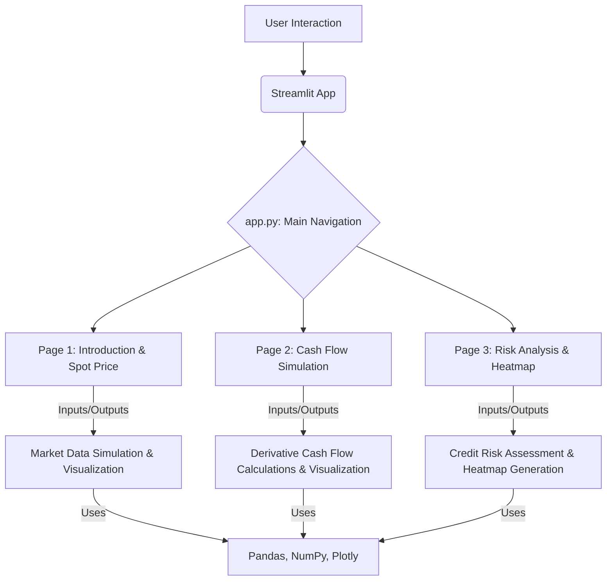

id: 686fdeb5e9e11968b47c9cfb_documentation
summary: Pricing and Valuation of Futures Contracts Documentation
feedback link: https://docs.google.com/forms/d/e/1FAIpQLSfWkOK-in_bMMoHSZfcIvAeO58PAH9wrDqcxnJABHaxiDqhSA/viewform?usp=sf_link
environments: Web
status: Published
# Codelab: Understanding Derivatives Clearing with QuLab

## 1. Introduction to QuLab and Central Clearing Concepts
Duration: 0:05

Welcome to the QuLab Codelab! This lab focuses on exploring the critical impact of central clearing on derivative contracts. We'll specifically contrast Exchange-Traded Derivatives (ETDs) like futures with Over-The-Counter (OTC) derivatives such as forwards.

<aside class="positive">
<b>Why is this important?</b>
Understanding central clearing is crucial for risk managers, compliance officers, and finance professionals. It helps in comprehending how mechanisms like margin requirements and daily settlement significantly reduce counterparty credit risk and minimize cash flow and price discrepancies between traditionally different contract types. This application provides a hands-on approach to visualize these complex financial concepts.
</aside>

**Key Concepts Explained:**

*   **Exchange-Traded Derivatives (ETDs):** Standardized contracts traded on organized exchanges (e.g., Futures). They typically have daily mark-to-market and margin requirements.
*   **Over-The-Counter (OTC) Derivatives:** Customized contracts negotiated directly between two parties. Traditionally, these are settled at maturity, posing higher counterparty risk.
*   **Central Clearing:** A process where a Central Counterparty (CCP) interposes itself between the two parties to a transaction, becoming the buyer to every seller and the seller to every buyer. This significantly reduces counterparty credit risk.
*   **Margin Requirements:** Collateral (initial margin, maintenance margin) posted by participants to cover potential losses on their positions, managed by the CCP.
*   **Daily Settlement (Mark-to-Market - MTM):** The daily process of adjusting the value of a derivative contract to its current market price, with gains or losses being exchanged between counterparties. This is a hallmark of centrally cleared contracts.
*   **Credit Risk:** The risk that one party to a financial instrument will fail to honor their obligations. Central clearing aims to mitigate this risk.

**Application Overview:**

The QuLab application is built using Streamlit and organized into three main sections, accessible via the sidebar:

1.  **Introduction & Spot Price:** Generates and visualizes synthetic market data for the underlying asset's spot price.
2.  **Cash Flow Simulation:** Simulates and compares the cash flow dynamics of Non-Centrally Cleared OTC (Forwards), Centrally Cleared OTC, and Exchange-Traded Futures, highlighting the impact of MTM and margin calls.
3.  **Risk Analysis & Heatmap:** Provides a qualitative assessment of credit risk for different derivative types and a conceptual heatmap illustrating residual price differences based on market parameters.

**Application Architecture Diagram:**



## 2. Setting up the Development Environment
Duration: 0:10

To get started with QuLab, you'll need Python installed on your system. We recommend Python 3.8 or newer.

### Prerequisites

*   Python 3.8+
*   pip (Python package installer, usually comes with Python)
*   Git (for cloning the repository, if applicable)

### Getting the Code

Assuming the provided code snippets are in files as follows:

```
quLab_app/
├── app.py
└── application_pages/
    ├── page1.py
    ├── page2.py
    └── page3.py
```

Create these files and populate them with the provided Python code.

### Installing Dependencies

Open your terminal or command prompt, navigate to the `quLab_app` directory, and install the required Python packages using pip:

```bash
pip install streamlit pandas numpy plotly
```

This command installs Streamlit, the web application framework, along with essential libraries for data manipulation (Pandas, NumPy) and plotting (Plotly).

### Running the Application

Once the dependencies are installed, you can run the Streamlit application from your terminal:

```bash
streamlit run app.py
```

This command will open a new tab in your web browser with the QuLab application running. You can interact with the various pages using the sidebar navigation.

## 3. Exploring the Introduction & Spot Price Page (`page1.py`)
Duration: 0:15

The `Introduction & Spot Price` page is the first step in our simulation. Its primary function is to generate synthetic market data, specifically a simulated spot price trend, which forms the basis for subsequent cash flow and risk analyses.

### Understanding the Market Data Simulation

The application models the daily spot price movement using a geometric Brownian motion-like process. This stochastic process is commonly used in financial modeling for asset prices.

The formula for daily spot price $S_t$ is:
$$ S_t = S_{t-1} \times e^{(\text{drift} + \text{random\_shock})} $$
where:
*   $S_t$ is the spot price at time $t$.
*   $S_{t-1}$ is the spot price at the previous time step.
*   $\text{drift} = (\text{risk\_free\_rate} - 0.5 \times \text{volatility}^2)$
*   $\text{random\_shock} = \text{np.random.normal}(0, \text{volatility})$

The `drift` term accounts for the expected average return, and `random_shock` introduces unpredictable daily fluctuations based on a normal distribution with a standard deviation equal to the `volatility`.

### Key Components of `page1.py`

#### Input Parameters

The sidebar of `page1.py` contains several input widgets that allow users to control the simulation parameters:

*   **Initial Spot Price ($S_0$):** The starting price of the underlying asset.
*   **Daily Volatility:** The magnitude of daily price fluctuations.
*   **Days to Maturity ($T$):** The number of days for the simulation period.
*   **Daily Risk-Free Rate ($r$):** The daily risk-free interest rate for compounding.
*   **Contract Size:** The number of units of the underlying asset per contract.
*   **Initial Margin:** Collateral required to open a position.
*   **Maintenance Margin:** The minimum margin balance to be maintained; triggers a margin call if breached.

These parameters are persisted across different pages of the application using `st.session_state`. This ensures that when you navigate to other pages, the simulation parameters remain consistent.

```python
# Input widgets (using st.session_state to persist values across page changes)
if 'initial_spot' not in st.session_state:
    st.session_state['initial_spot'] = 100.0
# ... similar for other parameters
initial_spot = st.sidebar.number_input("Initial Spot Price ($S_0$)", value=st.session_state['initial_spot'], min_value=1.0, help="Initial price of the underlying asset.", key='initial_spot_input')
# ... and so on for other inputs
```

#### Data Generation Function

The `generate_synthetic_data` function implements the stochastic process to create a series of spot prices.

```python
@st.cache_data
def generate_synthetic_data(initial_spot, volatility, days_to_maturity, risk_free_rate, contract_size, initial_margin, maintenance_margin):
    spot_prices = [initial_spot]
    for i in range(1, days_to_maturity + 1):
        drift = (risk_free_rate - 0.5 * volatility**2)
        random_shock = np.random.normal(0, volatility)
        spot_price = spot_prices[-1] * np.exp(drift + random_shock)
        spot_prices.append(spot_price)

    df = pd.DataFrame({'Day': range(days_to_maturity + 1), 'Spot_Price': spot_prices[:-1]})
    return df
```

<aside class="positive">
The `@st.cache_data` decorator is a powerful Streamlit feature. It caches the output of the function, meaning if the function is called again with the same inputs, it will return the cached result instead of re-running the computation. This significantly improves performance for data-intensive operations.
</aside>

#### Data Validation and Processing

Before displaying, the generated data undergoes validation to ensure its integrity and correctness.

```python
@st.cache_data
def validate_and_process_data(df):
    required_columns = ['Day', 'Spot_Price']
    for col in required_columns:
        if col not in df.columns:
            raise ValueError(f"Required column '{col}' is missing.")
    if not pd.api.types.is_integer_dtype(df['Day']):
        raise TypeError(f"Incorrect data type for 'Day' column. Expected int64, got {df['Day'].dtype}.")
    if df['Day'].duplicated().any():
        raise ValueError("Duplicate values found in 'Day' column.")
    if df['Spot_Price'].isnull().any():
        raise ValueError("Missing values found in 'Spot_Price' column.")
    return df
```

<aside class="negative">
Robust data validation is critical in financial applications to prevent erroneous calculations and ensure the reliability of simulation results. This function checks for missing columns, incorrect data types, duplicate days, and null values.
</aside>

#### Visualization and Summary Statistics

The page visualizes the simulated spot price trend using Plotly Express and displays summary statistics of the generated data.

```python
st.subheader("Simulated Spot Price Trend")
fig_spot = px.line(validated_data, x='Day', y='Spot_Price', title='Simulated Spot Price Over Time')
fig_spot.update_layout(yaxis_title="Spot Price ($)", xaxis_title="Day", font_size=12)
st.plotly_chart(fig_spot, use_container_width=True)

# Log summary statistics
log_summary_statistics(validated_data)
```

**Experiment:** Try adjusting the `Daily Volatility` and `Days to Maturity` parameters in the sidebar and observe how the `Simulated Spot Price Trend` chart changes. Higher volatility will lead to more erratic price movements.

## 4. Simulating Cash Flows (`page2.py`)
Duration: 0:20

The `Cash Flow Simulation` page is the core of the application, demonstrating the distinct cash flow patterns of different derivative types. It highlights how central clearing and daily mark-to-market mechanisms affect the cash flows compared to traditional OTC forwards.

### Theoretical Futures Price at Inception

Before diving into cash flows, the page calculates the theoretical futures price at inception ($F_0$). This calculation sets a baseline for valuing futures contracts.

The formula used is:
$$ F_0 = (S_0 - PV_{\text{Income}} + PV_{\text{Costs}}) \times (1 + r)^T $$
where:
*   $S_0$ is the initial spot price.
*   $PV_{\text{Income}}$ is the present value of any income generated by the underlying asset (e.g., dividends).
*   $PV_{\text{Costs}}$ is the present value of any costs associated with holding the underlying asset (e.g., storage costs).
*   $r$ is the daily risk-free rate.
*   $T$ is the time to maturity (in years, adapted from days to maturity).

```python
futures_price_inception = calculate_futures_price_at_inception(initial_spot, risk_free_rate, days_to_maturity / 365.0, pv_income_futures, pv_costs_futures) # Assuming T is in years for formula
st.metric("Calculated Futures Price at Inception ($F_0$)", f"${futures_price_inception:,.2f}")
```

### Cash Flow Simulation Scenarios

The application simulates cash flows for three distinct scenarios, chosen via a radio button:

1.  **Non-Centrally Cleared OTC (Forwards):** Represents traditional forward contracts.
2.  **Centrally Cleared OTC:** Represents OTC derivatives that are subject to central clearing.
3.  **Exchange-Traded Futures:** Represents standardized futures contracts.

#### 1. Non-Centrally Cleared OTC (Forwards) Cash Flows

Forward contracts are typically settled only at maturity. While their theoretical Mark-to-Market (MTM) value might fluctuate daily, actual cash flows (excluding initial premium/discount, if any) usually occur at the end of the contract's life.

The MTM value is calculated as:
$$ \text{Forward MTM Value}_t = (\text{Spot Price}_t - \text{Initial Forward Price}) \times \text{Contract Size} $$
Cash flow occurs only at maturity ($T$):
$$ \text{Cash Flow} = \text{Forward MTM Value}_{\text{maturity}} $$

The `simulate_forward_cash_flows` function reflects this by setting daily cash flows to zero except for the last day.

```python
@st.cache_data
def simulate_forward_cash_flows(initial_forward_price, simulated_spot_prices, contract_size, risk_free_rate):
    df = pd.DataFrame({'Spot_Price': simulated_spot_prices})
    df['Day'] = range(len(df))
    df['Forward_MTM_Value'] = (df['Spot_Price'] - initial_forward_price) * contract_size
    df['Cash_Flow'] = 0.0
    df.loc[df.index[-1], 'Cash_Flow'] = df['Forward_MTM_Value'].iloc[-1]
    return df[['Day', 'Forward_MTM_Value', 'Cash_Flow']]
```

#### 2. Exchange-Traded Futures and Centrally Cleared OTC Cash Flows

These two types of contracts share a similar cash flow mechanism due to daily mark-to-market and margin requirements managed by a clearinghouse (or CCP for cleared OTC).

**Daily PnL:**
$$ \text{Daily PnL}_t = (\text{Current Price}_t - \text{Previous Day's Settlement Price}_{t-1}) \times \text{Contract Size} $$
(In this simulation, `Current Price` is proxied by `simulated_spot_prices` and `Previous Day's Settlement Price` by `initial_futures_price` for Day 0, then `simulated_spot_prices[i-1]` for subsequent days.)

**Margin Balance Update:**
$$ \text{Margin Balance}_t = \text{Margin Balance}_{t-1} + \text{Daily PnL}_t $$

**Cash Flow Determination (Margin Call):**
If $\text{Margin Balance}_t < \text{Maintenance Margin}$:
$$ \text{Cash Flow}_t = \text{Initial Margin} - \text{Margin Balance}_t \quad (\text{margin call amount}) $$
(The margin balance is restored to the `Initial Margin` level after a margin call.)

Otherwise, if $\text{Margin Balance}_t \geq \text{Maintenance Margin}$:
$$ \text{Cash Flow}_t = \text{Daily PnL}_t \quad (\text{daily gain/loss is paid out/in}) $$

The `simulate_futures_cash_flows` and `simulate_centrally_cleared_otc_cash_flows` functions implement this logic. They are structurally very similar, reflecting how central clearing brings OTC derivatives cash flow dynamics closer to those of futures.

```python
@st.cache_data
def simulate_futures_cash_flows(initial_futures_price, simulated_spot_prices, contract_size, initial_margin, maintenance_margin):
    daily_pnl = [(simulated_spot_prices[i] - (initial_futures_price if i == 0 else simulated_spot_prices[i-1])) * contract_size for i in range(len(simulated_spot_prices))]
    margin_balance = [0.0] * len(simulated_spot_prices)
    cash_flow = [0.0] * len(simulated_spot_prices)

    margin_balance[0] = initial_margin + daily_pnl[0]
    if margin_balance[0] < maintenance_margin:
        cash_flow[0] = initial_margin - margin_balance[0]
        margin_balance[0] = initial_margin

    for i in range(1, len(simulated_spot_prices)):
        margin_balance[i] = margin_balance[i-1] + daily_pnl[i]
        cash_flow[i] = daily_pnl[i]

        if margin_balance[i] < maintenance_margin:
            cash_flow[i] = initial_margin - margin_balance[i]
            margin_balance[i] = initial_margin

    df = pd.DataFrame({
        'Day': range(len(simulated_spot_prices)),
        'Futures_Price_Track': simulated_spot_prices,
        'Daily_PnL': daily_pnl,
        'Margin_Balance': margin_balance,
        'Cash_Flow': cash_flow
    })
    return df
```

### Visualization of Cash Flows and Margin Account

The page uses Plotly Graph Objects (`go.Figure`) to plot the `Cash Flow`, `Daily PnL`, and `Margin Balance` over time, providing a clear visual comparison of the different derivative types.

```python
fig_cash_flow = go.Figure()
fig_cash_flow.add_trace(go.Scatter(x=df_results['Day'], y=df_results['Cash_Flow'], mode='lines', name='Cash Flow'))
if 'Daily_PnL' in df_results.columns:
    fig_cash_flow.add_trace(go.Scatter(x=df_results['Day'], y=df_results['Daily_PnL'], mode='lines', name='Daily PnL'))
# ... similar for Margin_Balance and MTM_Value
st.plotly_chart(fig_cash_flow, use_container_width=True)
```

**Experiment:**
1.  First, select "Non-Centrally Cleared OTC" and observe the cash flow. You'll notice a large single cash flow at maturity.
2.  Next, switch to "Exchange-Traded Futures" or "Centrally Cleared OTC". Observe how the cash flows become daily and how the margin balance fluctuates, potentially leading to margin calls.
3.  Adjust parameters like `Volatility` or `Initial Margin` on the "Introduction & Spot Price" page and then return to this page to see their impact on cash flow dynamics.

## 5. Analyzing Risk and Price Differences (`page3.py`)
Duration: 0:15

The `Risk Analysis & Heatmap` page focuses on qualitative credit risk assessment and a conceptual visualization of residual price differences that might persist even with central clearing.

### Credit Risk Assessment

This section provides a simplified qualitative assessment of credit risk based on the type of derivative contract.

```python
def determine_credit_risk(scenario_type):
    if scenario_type == "Non-Centrally Cleared OTC":
        return "High"
    elif scenario_type == "Centrally Cleared OTC":
        return "Low"
    elif scenario_type == "Exchange-Traded Futures":
        return "Low"
    else:
        return "N/A"

scenario_type_for_risk = st.radio(
    "Select Derivative Type for Credit Risk Assessment:",
    ("Non-Centrally Cleared OTC", "Centrally Cleared OTC", "Exchange-Traded Futures"),
    key='scenario_type_risk_assessment'
)
credit_risk = determine_credit_risk(scenario_type_for_risk)
st.metric("Credit Risk Exposure", credit_risk)
```

<aside class="positive">
Central clearing significantly reduces counterparty credit risk for both ETDs and centrally cleared OTC derivatives because the CCP acts as the counterparty to all trades, mutualizing and managing default risk. Non-centrally cleared OTC derivatives, however, still carry significant bilateral credit risk.
</aside>

### Residual Price Differences: Impact of Correlation and Volatility

Even with the advantages of central clearing, minor price differences can still exist between futures and forwards due to factors like the correlation between interest rates and the underlying asset's price, and the volatility of interest rates. This application uses a heatmap to conceptually illustrate these potential residual differences.

<aside class="negative">
The heatmap data is currently dummy data (`np.random.rand`). In a real-world financial application, this would be replaced by complex models that calculate price differences based on sophisticated interest rate models and their correlation with the underlying asset.
</aside>

#### Heatmap Data Generation (Dummy)

The `calculate_price_difference_heatmap_data` function generates a DataFrame for the heatmap. It takes ranges for correlation and volatility and populates the DataFrame with random values to simulate price differences.

```python
@st.cache_data
def calculate_price_difference_heatmap_data(correlation_range, volatility_range):
    # ... (input validation and range setup)
    num_points = 10
    correlation_values = np.linspace(min(correlation_start, correlation_end), max(correlation_start, correlation_end), num_points)
    volatility_values = np.linspace(min(volatility_start, volatility_end), max(volatility_start, volatility_end), num_points)

    # Create dummy price difference data
    price_difference_data = np.random.rand(num_points, num_points)

    df = pd.DataFrame(price_difference_data, index=correlation_values.round(2), columns=volatility_values.round(3))
    df.index.name = "Interest Rate Correlation"
    df.columns.name = "Interest Rate Volatility"
    return df
```

#### Heatmap Visualization

Plotly Express's `imshow` function is used to create the heatmap, visually representing the "Price Difference" across varying "Interest Rate Correlation" and "Interest Rate Volatility".

```python
heatmap_data = calculate_price_difference_heatmap_data(correlation_range, volatility_range)
fig_heatmap = px.imshow(heatmap_data,
                         labels=dict(x="Interest Rate Volatility", y="Interest Rate Correlation", color="Price Difference"),
                         x=[f"{col:.3f}" for col in heatmap_data.columns.astype(float)],
                         y=[f"{idx:.2f}" for idx in heatmap_data.index.astype(float)],
                         color_continuous_scale="Viridis",
                         title="Price Difference Heatmap (Dummy Data)")
st.plotly_chart(fig_heatmap, use_container_width=True)
```

**Experiment:** Adjust the `Min Correlation`, `Max Correlation`, `Min Volatility`, and `Max Volatility` sliders in the sidebar. While the data is random, you can observe how the heatmap dynamically re-renders with new ranges.

### References and License

This section provides the academic reference that underpins some of the concepts discussed in the application, specifically regarding central clearing and its impact on derivatives. It also includes the QuantUniversity license information, emphasizing the educational purpose of the tool.

## 6. Understanding the Streamlit Framework and Best Practices
Duration: 0:10

This section covers the core Streamlit functionalities utilized in QuLab and discusses general best practices for building robust Streamlit applications.

### Key Streamlit Components Used

QuLab leverages several fundamental Streamlit components for creating an interactive user interface:

*   `st.set_page_config()`: Configures the overall page settings, such as title and layout.
*   `st.sidebar`: Creates content within the sidebar for navigation and input parameters.
*   `st.title()`, `st.header()`, `st.subheader()`: Display different levels of headings.
*   `st.markdown()`: Renders markdown text, allowing for rich text formatting, including mathematical formulas.
*   `st.divider()`: Adds a horizontal line for visual separation.
*   `st.number_input()`: Creates a numeric input widget.
*   `st.slider()`: Creates a slider widget for selecting a range of values.
*   `st.radio()`: Creates a radio button group for selecting one option.
*   `st.metric()`: Displays a key value with an optional indicator of how it's changed.
*   `st.dataframe()`: Displays a Pandas DataFrame as an interactive table.
*   `st.plotly_chart()`: Renders a Plotly figure.
*   `st.error()`: Displays an error message.

### Performance Optimization with `st.cache_data`

As seen in `page1.py` and `page2.py`, the `@st.cache_data` decorator is used extensively. This is a crucial optimization for Streamlit applications.

When a Streamlit app reruns (e.g., due to user input), all the code from top to bottom executes again. If data generation or heavy computation functions were not cached, they would re-run unnecessarily, making the app slow and unresponsive. `st.cache_data` (and its older counterpart `st.cache`) memoizes the function's output, so subsequent calls with the same arguments retrieve the result from cache instead of recomputing.

### Managing State with `st.session_state`

For multi-page applications or applications where user inputs need to persist across reruns or page changes, `st.session_state` is invaluable.

In `page1.py`, parameters like `initial_spot`, `volatility`, etc., are stored in `st.session_state`:

```python
if 'initial_spot' not in st.session_state:
    st.session_state['initial_spot'] = 100.0
initial_spot = st.sidebar.number_input("Initial Spot Price ($S_0$)", value=st.session_state['initial_spot'], ...)
```

This ensures that when the user navigates between pages, the input values they set are remembered and passed to the functions on subsequent pages. Without `st.session_state`, these values would reset on every page load or interaction, leading to a frustrating user experience.

### Multi-Page Application Structure

The QuLab application follows a common Streamlit pattern for multi-page apps:

*   `app.py`: Acts as the main dispatcher. It sets up the overall app layout and uses `st.sidebar.selectbox` to determine which sub-page to load based on user selection.
*   `application_pages/`: A directory containing separate Python files for each page (`page1.py`, `page2.py`, `page3.py`). Each page file encapsulates its own Streamlit logic and functions.

This modular structure makes the application easier to organize, develop, and maintain.

### Extending and Improving the Application

QuLab provides a solid foundation for understanding derivatives clearing. Here are some ideas for future extensions:

*   **Implement Real Data:** Replace the dummy heatmap data in `page3.py` with actual calculations for price differences based on interest rate models.
*   **More Derivative Types:** Add simulations for other derivatives like options, swaps, or different types of forwards (e.g., currency forwards).
*   **Historical Data Integration:** Allow users to upload or select historical market data to run simulations based on real past events.
*   **Portfolio Simulation:** Extend the cash flow simulation to manage a portfolio of derivative contracts.
*   **Interactive Controls for Graphs:** Add more controls to Plotly charts (e.g., range sliders, zoom).
*   **Unit Testing:** Implement unit tests for the core calculation functions (`generate_synthetic_data`, `simulate_futures_cash_flows`, etc.) to ensure accuracy.

<aside class="positive">
This codelab has equipped you with a comprehensive understanding of the QuLab application's functionalities, underlying financial concepts, and the Streamlit framework used to build it. You are now ready to further explore, modify, and expand upon this application.
</aside>

<button>
  [Download App Source Code (Conceptual)](https://example.com/quLab_source_code.zip)
</button>
(Note: This is a placeholder link. In a real scenario, it would point to a GitHub repository or a downloadable zip file.)
